# 帆航OA系统

##  项目介绍

​     帆航OA系统基于开源流程引擎camunda开发的办公自动化系统。采用前后端分离架构，基于可视化的表单建模、流程建模工具，零代码快速构建业务OA应用。

## 项目演示

地址：http://119.29.209.39:8000  账号密码：admin/123456

## 技术栈

后端：SpringBoot+JWT+Shiro+mybatis-plus

流程引擎：camunda

前端：Vue3， ant-design-vue

中间件：redis缓存，minio文件管理

数据库：mysql或postgresql

## 产品功能

### 1.表单设计

   在线可视化表单设计器可快速构建业务表单，表单设计器包含表单组件、辅助组件、布局组件、系统组件等多种组件，可构建复杂页面功能，支持表单预览，所见即所得。

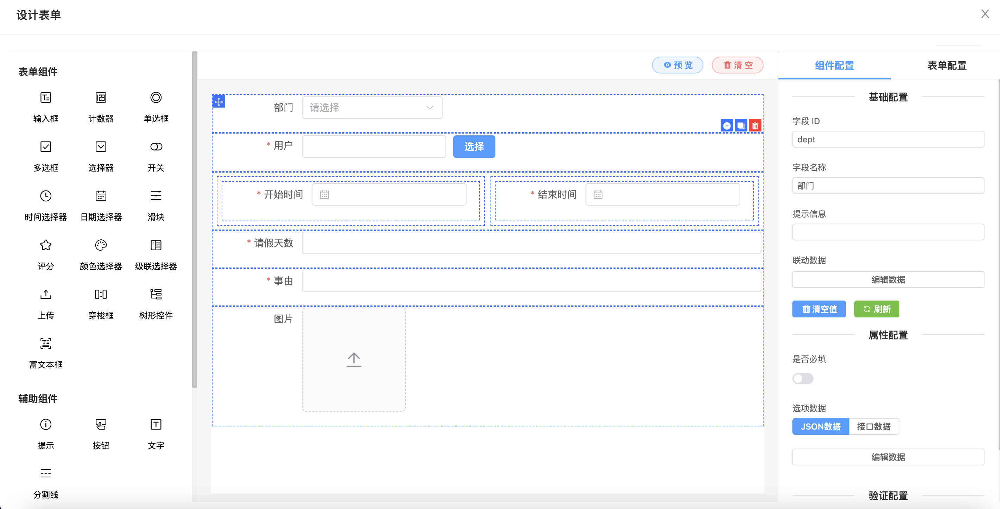

   基于设计的表单动态生成业务实体表，页面设计完成后，发布即可完成对应表单的数据库表结构设计。操作简单，业务人员能够快速上手。

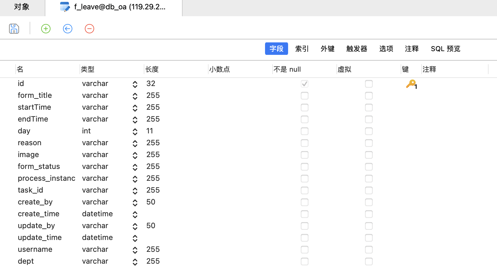

### 2.流程设计

​    BPMN2.0规范，基于开源camunda流程引擎开发，支持浏览器在线设计流程；支持驳回、拒绝、撤销等多种中国特色流程操作。

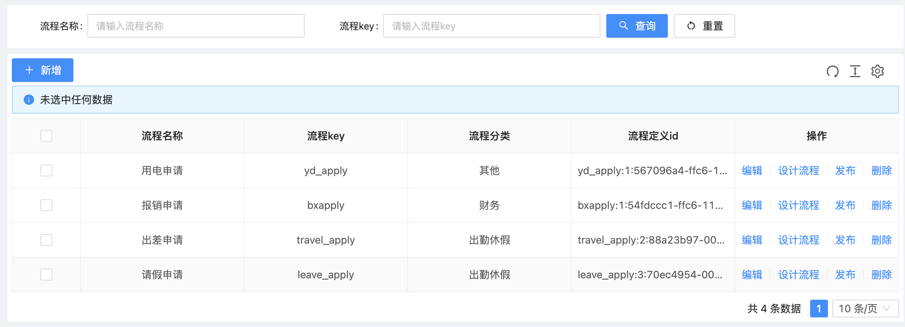

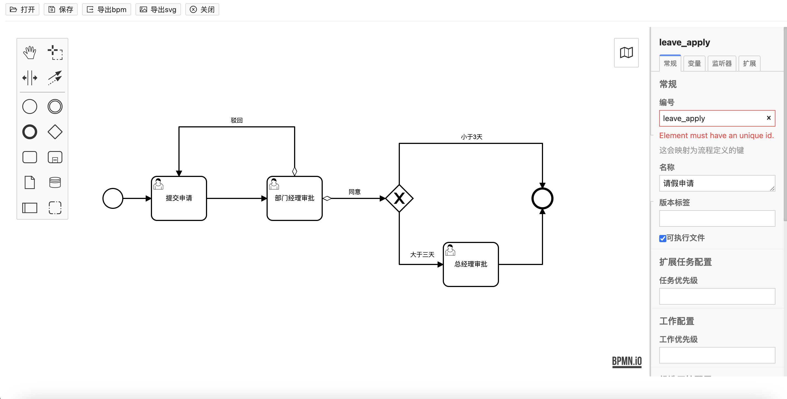

支持流程节点和设计的表单绑定。

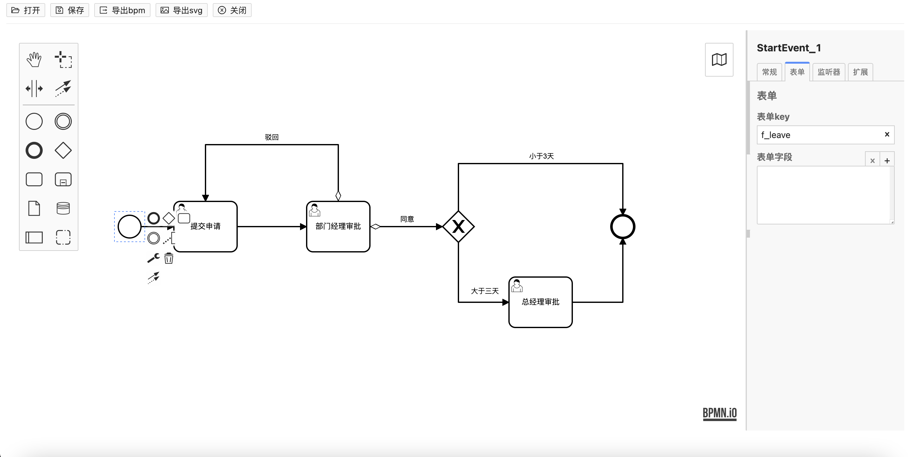

流程设计完成，发布部署流程。

### 3.流程执行监听

​     系统内置了表达式和Java类两种监听类型，支持开发人员扩展，方便业务人员在设计流程时参照，配置节点审批人的获取方式。

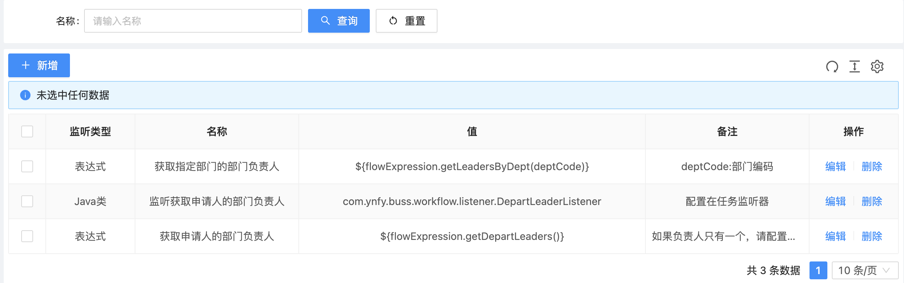

### 4.流程发起

​      申请人发起流程，进入审批流转环节。选择要发起的流程类型，例如请假、报销等，并填写表单信息。不同流程类型，需要填写的信息也会有所不同。填写完成后，点击“提交”按钮。

​      根据流程的设定，申请会自动发送给相应的审批人。审批人可以在系统中查看您的申请，并根据需要进行审批。

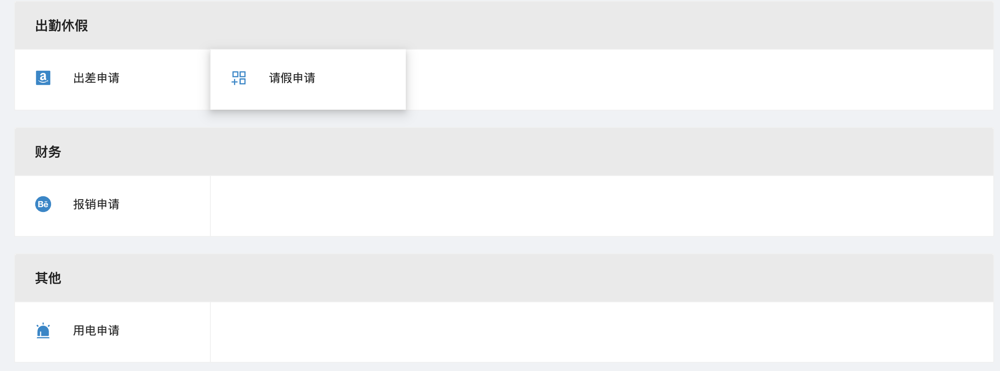

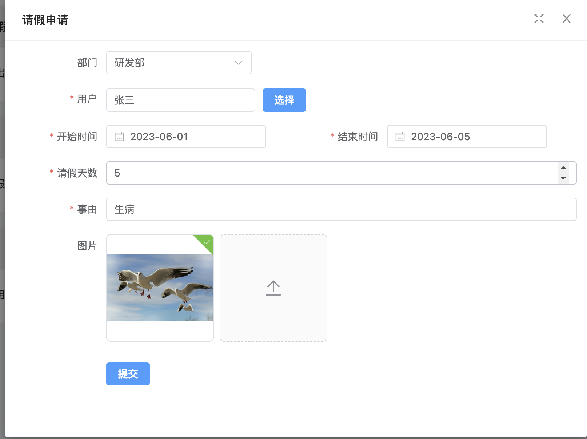

### 5.我的发起

​     在发起列表中，可以看到历史申请的详细信息，包括当前所处环节、办理人、流程状态、发起时间等。选择发起的申请，点击进入详细页面。在详细页面中，可以查看申请的详细内容、审批流程情况等。可以根据需要撤销已提交的申请。

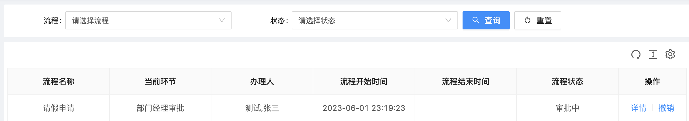

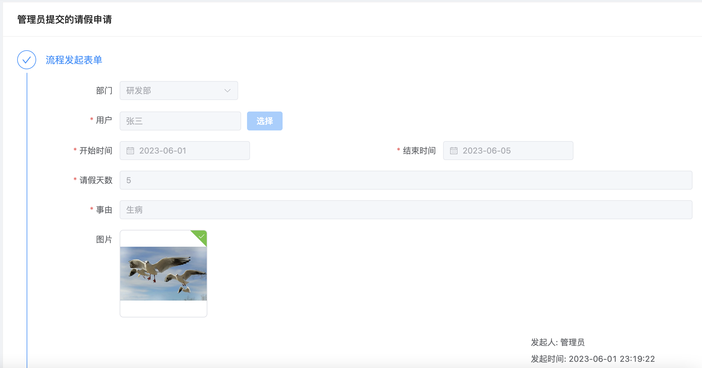

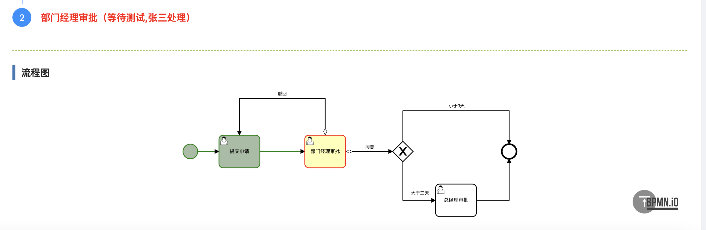

### 6.我的待办

​      在待办列表中，可以看到所有待办事项的详细信息，包括待办事项的类型、发起人、发起时间等。选择要处理的待办事项，点击进入详细页面。在详细页面中，可以查看任务的详细内容、审批流程和历史记录等。可以随时查看自己的待办事项的状态和处理情况，并根据需要进行跟进。

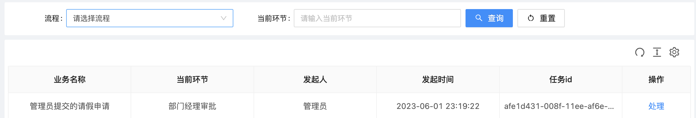

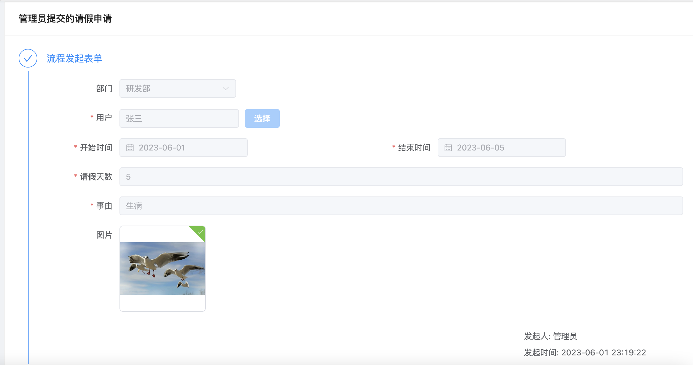

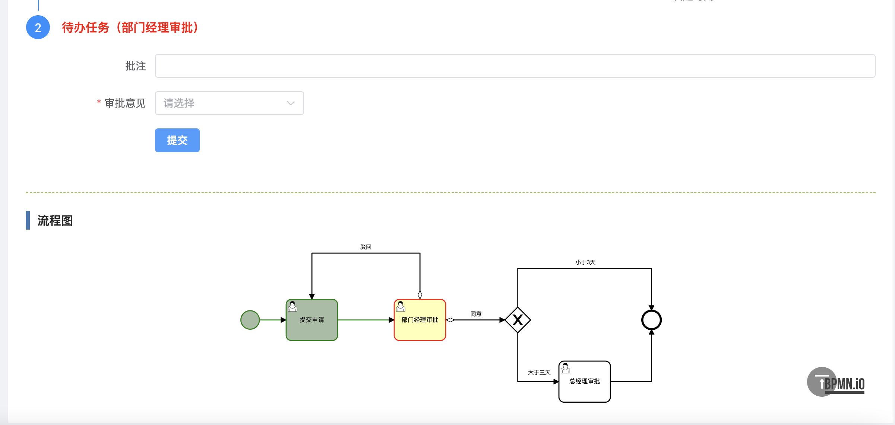

### 7.我的已办

​     根据需要对已办事项进行筛选查询，以便更好地管理和查看任务。选择要查看的已办事项，点击进入详细页面。在详细页面中，可以查看任务的详细内容、审批流程和历史记录等。

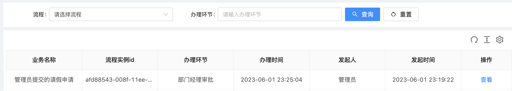

 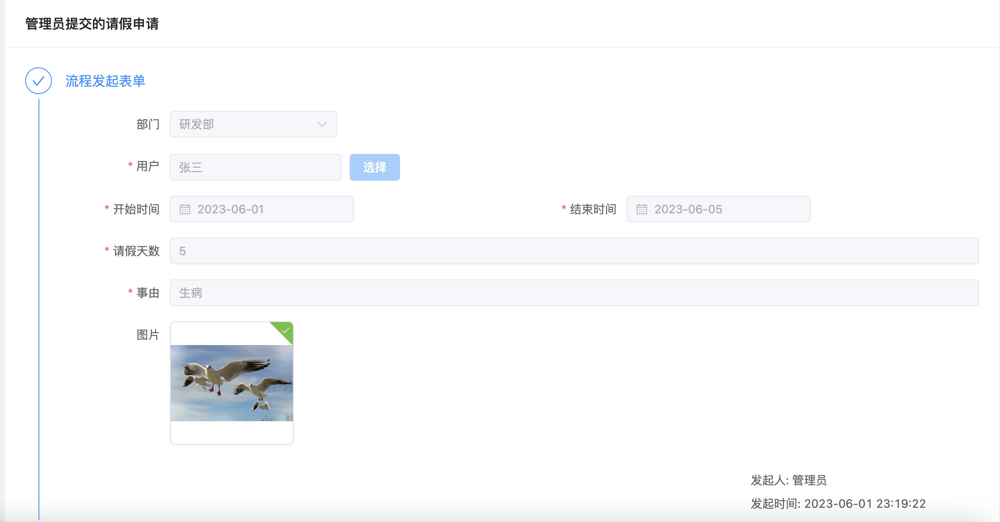

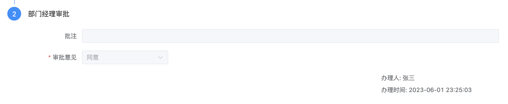

## 流程图

## 咨询

杨先生：

邮箱：[1041114134@qq.com](mailto:835487894@qq.com)

手机：15287192249

微信号：FinelyYang
