#  项目介绍

​    基于开源流程引擎camunda开发的办公自动化系统。采用前后端分离架构，基于可视化的表单建模、流程建模工具，零代码快速构建业务OA应用。

# 项目演示

   地址：http://oa.farsailing.com:8000  账号密码：admin/123456

# 技术栈

后端：SpringBoot+JWT+Shiro+mybatis-plus

流程引擎：camunda

前端：Vue3， ant-design-vue

中间件：redis缓存，minio文件管理

数据库：mysql或postgresql

# 功能说明

​	系统支持路由表单和自定义表单两种表单的审批。

​	路由表单适用于业务较为复杂，各审批环节（流程节点）展示的表单内容繁多，且可能每个审批节点需展示不同的审批表单情形。

​	自定义表单则是表单单一，内容较为简单，审批过程中每个节点均展示相同的表单情形。

## **待办管理**

### **我的发起**

​	在发起列表中，可以看到历史申请的详细信息，包括当前所处环节、办理人、流程状态、发起时间等。

​	选择发起的申请，点击进入详细页面。在详细页面中，可以查看申请的详细内容、审批流程情况等。

​	可以根据需要撤销已提交的申请。

### **我的待办**

​	在待办列表中，可以看到所有待办事项的详细信息，包括待办事项的类型、发起人、发起时间等。选择要处理的待办事项，点击进入详细页面。在详细页面中，可以查看任务的详细内容、审批流程和历史记录等。

​	可以随时查看自己的待办事项的状态和处理情况，并根据需要进行跟进。

### **我的已办**

根据需要对已办事项进行筛选查询，以便更好地管理和查看任务。

选择要查看的已办事项，点击进入详细页面。在详细页面中，可以查看任务的详细内容、审批流程和历史记录等。

## **流程管理**

### **表单设计**

​	在线可视化表单设计器，拖拽式设计业务表单，组件类型丰富，自定义表单样式，可快速构建业务表单，表单设计器包含表单组件、辅助组件、布局组件、系统组件等多种组件，可构建复杂页面功能，支持表单预览，所见即所得。

​	基于设计的表单动态生成业务实体表，页面设计完成后，发布即可完成对应表单的数据库表结构设计。操作简单，业务人员能够快速上手。

### **流程设计**

​	BPMN2.0规范，基于开源camunda流程引擎开发，支持浏览器在线设计流程，驳回、拒绝、撤销等多种中国特色流程操作。

支持流程节点和设计的表单绑定。流程设计完成，发布部署流程。

### **执行监听**

​	系统内置了表达式和Java类两种监听类型，支持开发人员扩展，方便业务人员在设计流程时参照，配置节点审批人的获取方式。

###  **流程实例**

​	查看所有发起的流程实例，包含历史流程实例。查看流程实例审批明细，进行中的流程实例可以进行关闭操作。

### **任务管理**

​	查看当前正在执行中的任务，委派任务给指定的人办理。

# 使用说明

##  **自定义表单流程**

### **步骤说明**

####  **表单设计**

​	在“流程管理”-“表单设计”菜单，新建自定义表单。表单key需以“f_”开头，且不能重复。 

新建完成后，点击“设计表单”，然后根据业务设计表单。

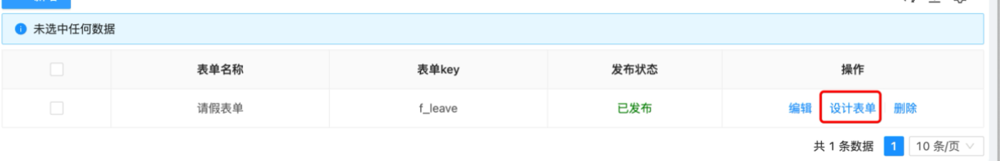

设计的表单如下：

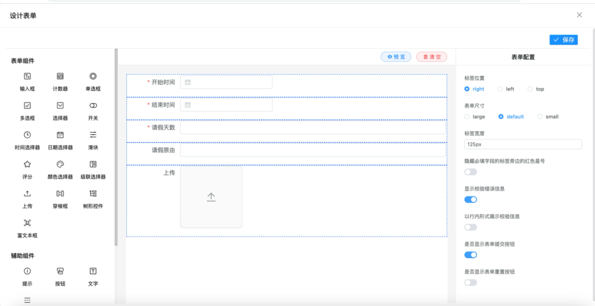

表单中，每一项的字段ID必填，不允许重复。为了易理解，请修改为见文知意的id，该id在建表时会作为业务表的字段名称。

系统还内置了几种常用的组件，方便业务人员在设计表单时直接拖拽使用。

表单设计完成系统自动判断是否需要发布，点击发布按钮，自动更新业务表结构。

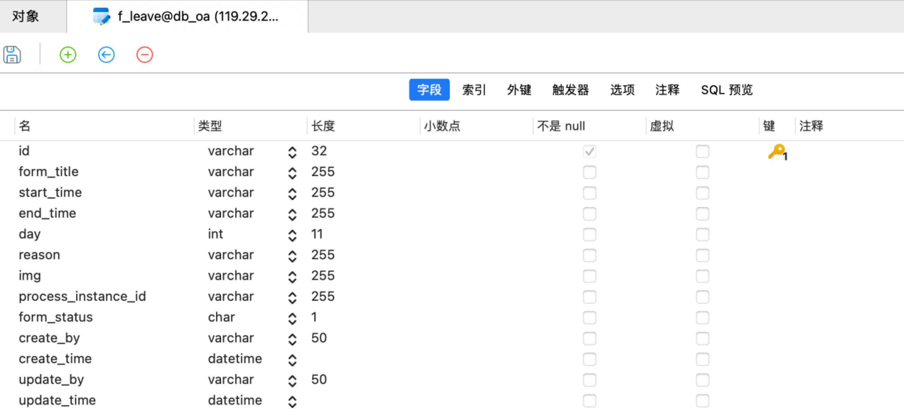

#### **流程设计**

​	在“流程管理”-“流程设计”菜单，新建流程。

新建完成后，点击“设计流程”，然后根据业务设计流程。

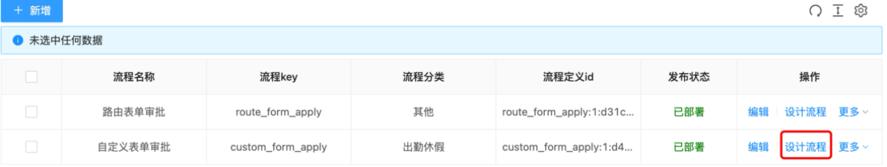

设计的流程图如下：

流程的编号即流程定义key，很重要，需唯一。

（一）开始节点：

创建者为：starter，这个流程变量表示流程发起人，在“提交申请”节点用到。

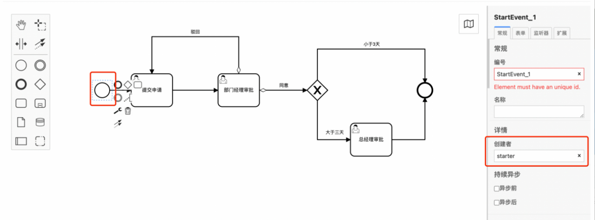

  

（1）开始节点的表单key必须配置。

（2）开始节点表单key为自定义表单时，其他节点不能再设置另外的表单key（即必须与开始节点的表单key一致）。

（3）开始节点表单key为路由表单时，用户节点的表单key不能为空。

（4）开始节点表单key为路由表单时，用户节点的表单key不能为自定义表单。即不允许混合使用。

（二）提交申请：

代理人从流程变量starter自动取值。程序内部做了控制判断，会自动完成该节点的审批。

表单key和开始节点保持一致，方便驳回时再次填写表单。

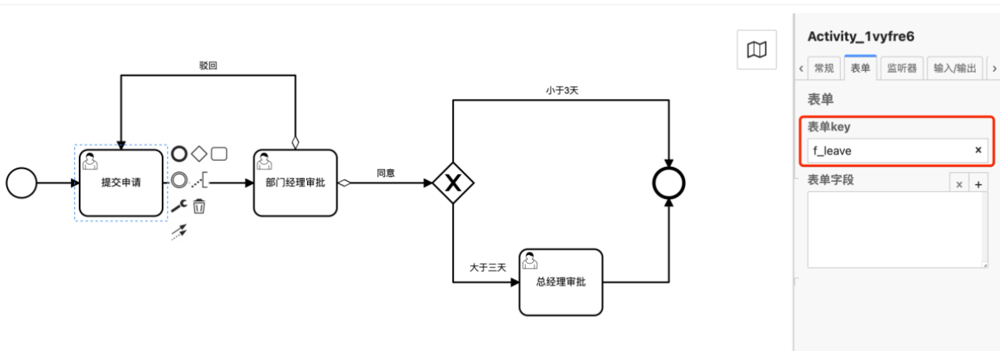

  

（三）部门经理审批和总经理审批

均不需设置表单的key。审批流转到此两节点时会加载开始节点的表单，并嵌入审批的页面。

节点没有设置审批人，则需要到“任务管理”委派任务指定新的办理人。

节点可以通过代理表达式的方式设置审批人。

表达式的配置方法：

查询申请人所属部门内的指定角色人员：${flowExpression.getDepartUserByRole(roleCode)}，roleCode: 角色编码，请在角色管理查看角色编码。

查询申请人所属单位内的指定角色人员：${flowExpression.getOrgUserByRole(roleCode)}，roleCode: 角色编码，请在角色管理查看角色编码。

如果负责人只有一个，请配置在代理人(assignee)；如果为多个，请配置在候选用户(candidate users)。如果不能确定负责人是一个还是多个请配置在候选用户(candidate users)。

同意和驳回：

连线上配置，opinion值，1表示同意，2表示驳回。

同意的表达式配置如下图所示：

驳回需要注意在连线上的名称只能为“驳回”，提交表单时程序会判断是否配置“驳回”的逻辑，如果配置了，驳回时就会流转到配置的节点，如果没有配置则驳回到开始节点的下一个用户任务节点，此处即“提交申请”节点。

驳回的表达式配置如下图所示：

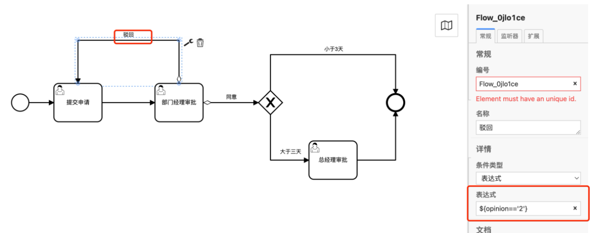

条件判断：

${day>3}：day是流程变量，从请假的表单而来。如果流程流转到当前环节的所有表单中都找不到这个流程变量的话，流程将会异常结束，这个情况需要注意。  

审批人除了使用表达式或者Java类外，还可以直接指定审批人用户名。

#### 流程部署

​	流程设计完成后，保存流程。  

保存成功后，部署流程。

#### 发起流程及流转

​	在“自定义表单示例”菜单，点击“自定义表单审批”。

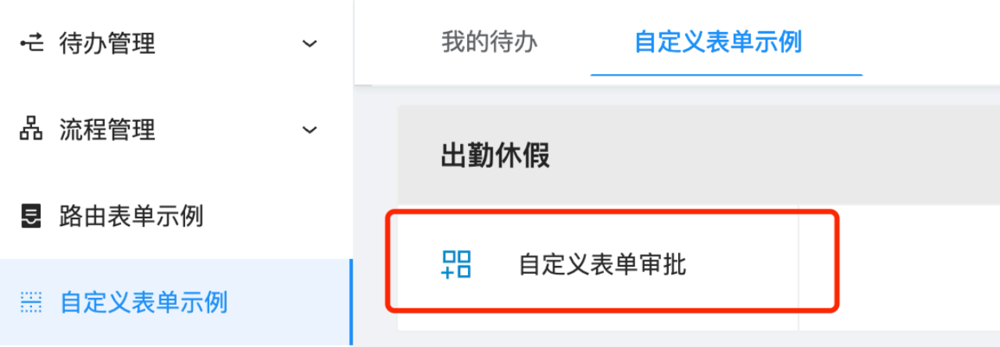

填写表单，点击“提交”。

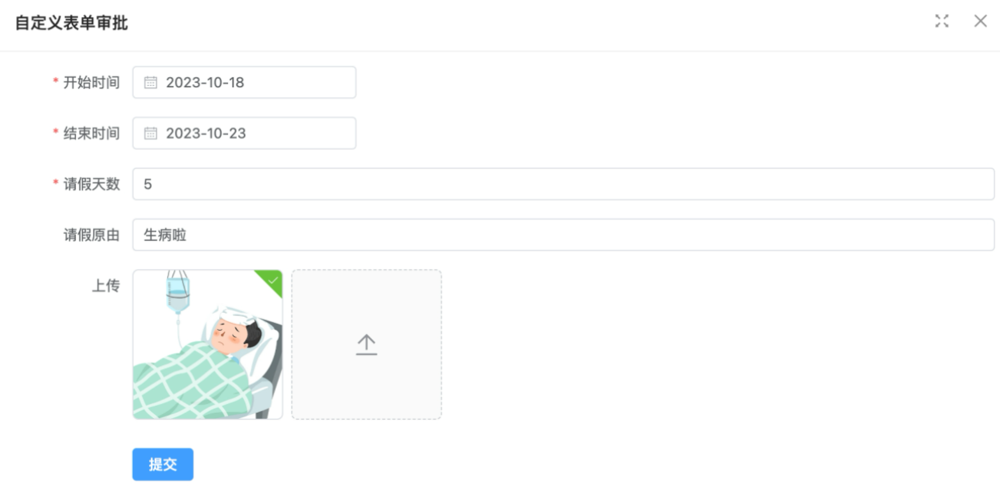

由于没有配置办理人，到任务管理，委派任务。

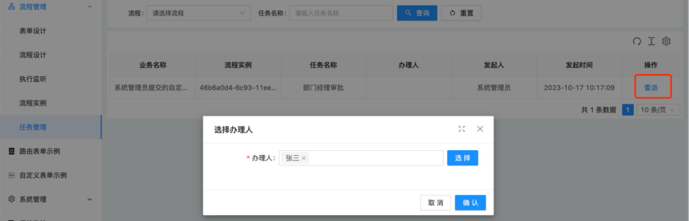

张三的账号登录后，即可在“待办管理”-“我的待办”，看到待办任务，处理即可。

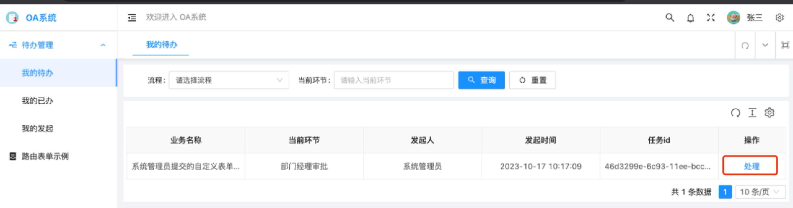

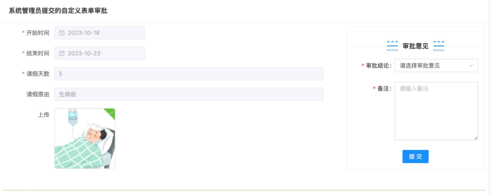

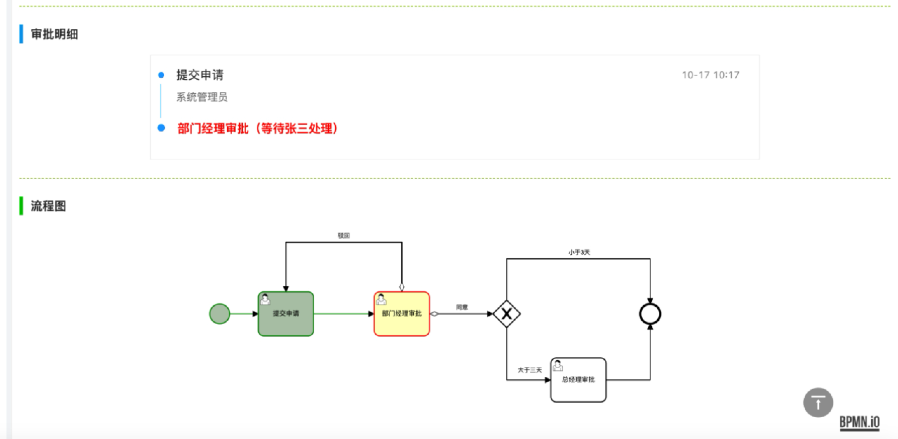

选择审批结论后，系统会自动获取下一环节办理人，允许重新指定办理人。

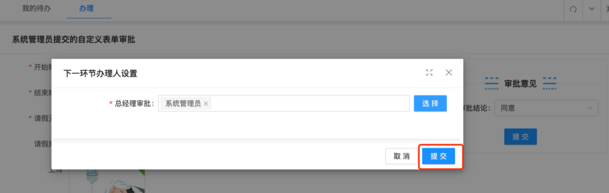

使用系统管理员账号登录后，处理待办任务。

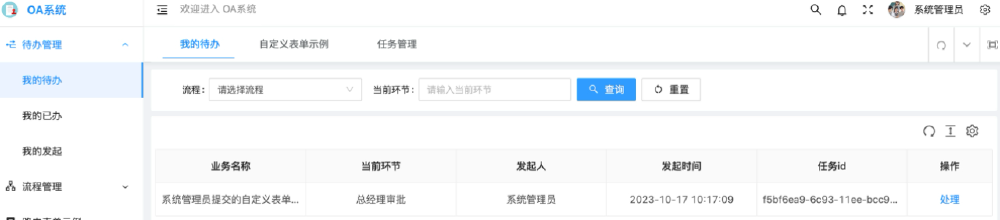

可以在“我的发起”中查看流程流转详情。

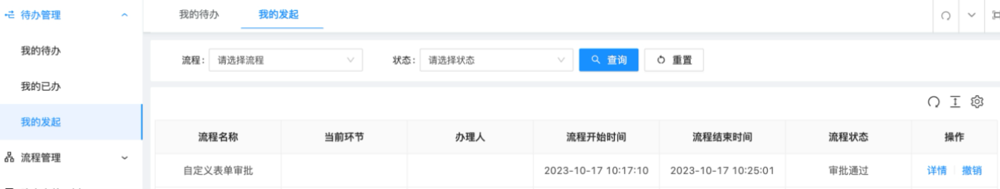

至此，流程审批完成。

 

##  **路由表单流程**  

###  **步骤说明**

​	路由表单无需设计表单。

#### **流程设计**

​	新增流程设计：

路由表单流程开始节点配置的表单key和自定义表单流程不一样，它使用的是vue表单路由。要求通过该路由以及参数能够在浏览器访问到页面。

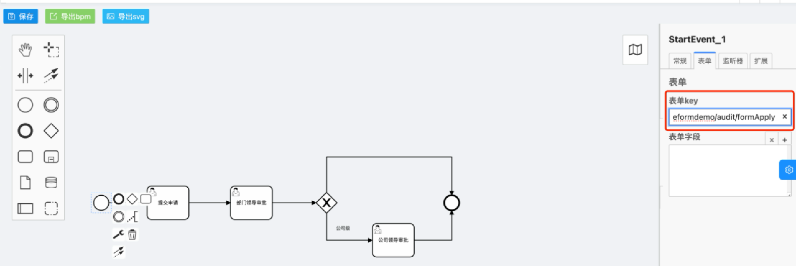

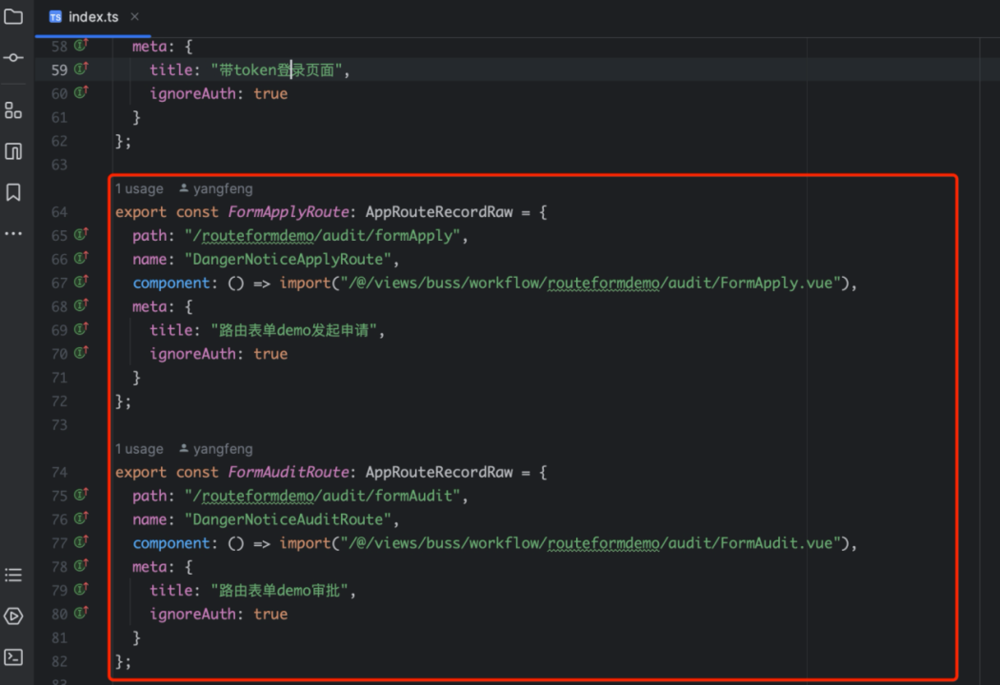

提交申请节点表单key保持和开始节点一致。

部门领导审批和公司领导审批可以通过表达式或者固定值的方式设置办理人，如下图所示：

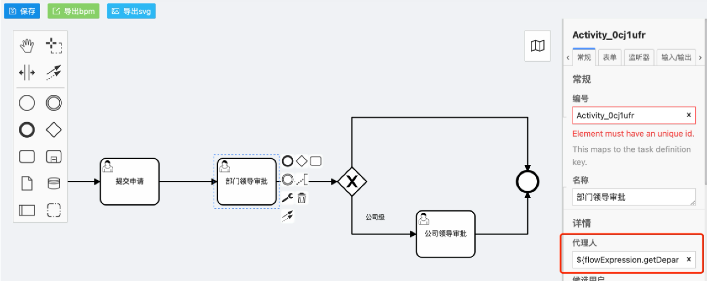

其他节点的配置和自定义表单流程配置方法一致，节点表单key可以不能使用自定义的表单。需要注意的是一个流程，允许每个用户节点配置不同的表单key。

####  流程部署

​	参照自定义表单流程。

#### 发起流程及流转

​	在“路由表单示例”菜单，点击“新增”。填写表单后，点击提交审批。

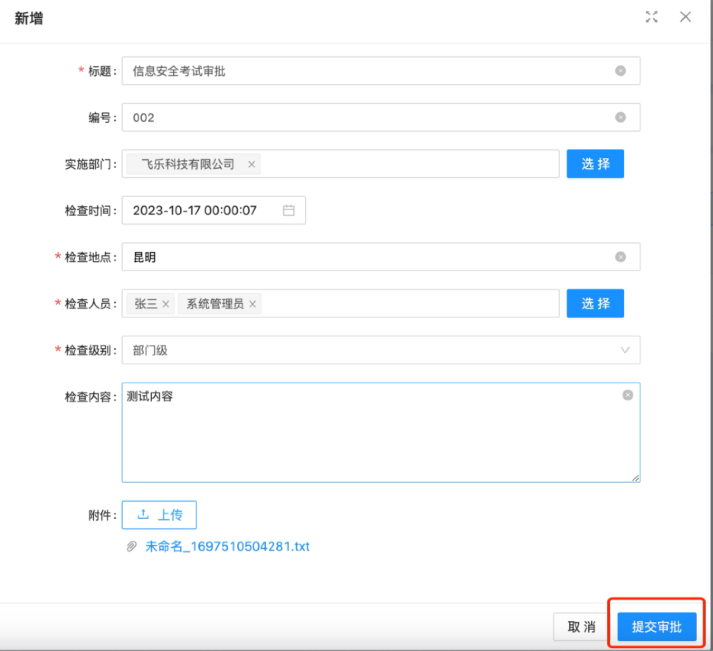

提交审批时，根据配置的流程自动关联到下一步审批节点和办理人，允许重新选择办理人：

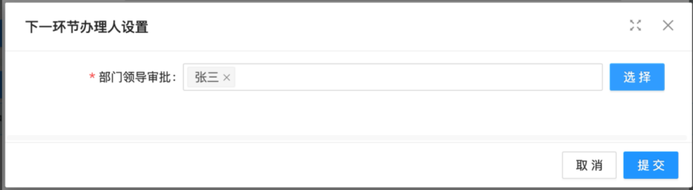

提交时审批后进入流程流转环节。使用张三账号登录，处理待办任务。

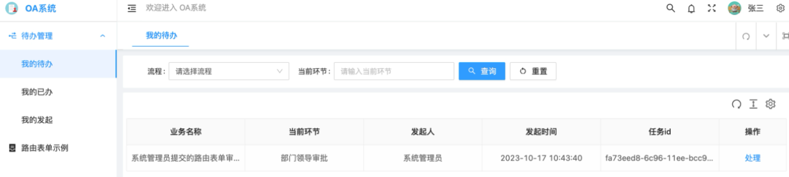

处理任务页面会根据路由和提交数据的id渲染页面。

审批完成，流程结束。在“我的发起”查看详情。

在路由表单列表，可以看到该记录的审批状态，同时可以查看审批明细。

# 咨询

杨先生：

邮箱：[1041114134@qq.com](mailto:835487894@qq.com)

手机：15287192249

微信号：FinelyYang
